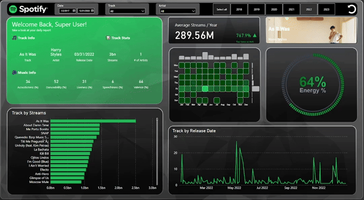

# Spotify 2023 Data Insights

## Table of Contents
1. [Project Overview](#project-overview)
2. [Problem Statement](#problem-statement)
3. [Key Challenges](#key-challenges)
4. [Tools Used & Skills Demonstrated](#tools-used--skills-demonstrated)
5. [Observations](#observations)
6. [Conclusion](#conclusion)
7. [Key Takeaways](#key-takeaways)
8. [Recommendations](#recommendations)
9. [References](#references)
10. [Connect With Me](#connect-with-me)

---

## Project Overview
The **Spotify 2023 Data Insights Dashboard** is a comprehensive analysis of global music streaming trends using **Power BI**. This project explores **top-streamed tracks and artists, audio feature correlations, and seasonal streaming patterns** to provide actionable insights for artists, producers, and streaming platforms.

The dashboard leverages **interactive visualizations** to track how **danceability, energy, and valence impact a song’s success**, while also highlighting industry shifts in **streaming behavior** over time.

---

## Problem Statement
In the competitive digital music industry, understanding **which factors contribute to a song's success, how artists sustain engagement, and how streaming trends evolve** is crucial for decision-making. This project seeks to answer:

- What are the **most streamed songs and artists** in 2023?
- How do **audio features** (danceability, energy, valence) correlate with track popularity?
- Are there **seasonal trends** affecting music streaming?
- How can **interactive data visualization** support industry stakeholders in making data-driven decisions?

---

## Key Challenges
### 1. **Streaming Trend Analysis**
  - Identifying **patterns in total streams** across different years.
  - Understanding how **release timing** affects long-term streaming success.

### 2. **Artist & Track Performance**
  - Determining **which artists consistently top the charts**.
  - Analyzing the **streaming longevity** of specific tracks.

### 3. **Audio Feature Correlation**
  - Examining the impact of **danceability, energy, and valence** on hit songs.
  - Identifying how these attributes influence **listener engagement**.

### 4. **Visualization & Insights Extraction**
  - Designing a **user-friendly Power BI dashboard** to communicate complex trends.
  - Implementing **interactive filters and slicers** for deeper exploration.

---

## Tools Used & Skills Demonstrated
- **Power BI**: Developed a **fully interactive dashboard** for analyzing Spotify streaming trends.
- **Data Analysis & Visualization**: Extracted insights from raw streaming data and structured it for stakeholder decision-making.
- **Data Cleaning & Transformation**: Processed data inconsistencies and handled missing values effectively.
- **Business Intelligence**: Translated raw data into actionable insights for the music industry.

---

## Observations (Based on Power BI Visuals)
### **1. Most Streamed Songs & Artists**
- **Blinding Lights by The Weeknd** is the **most streamed song**, surpassing **4 billion streams**.
- **Top Artists:** The Weeknd, Taylor Swift, and Ed Sheeran dominate the charts in terms of total streams.
- Songs with **higher danceability** tend to rank higher in streaming counts.

### **2. Streaming Trends Over Time**
- The majority of **streams come from songs released between 2018-2023**, indicating the dominance of modern hits.
- A **sharp rise in streaming activity from 2020 onward** suggests that digital music consumption surged.
- **Older tracks** (pre-2000) accumulate far fewer streams compared to modern releases.

### **3. Seasonal & Weekly Streaming Patterns**
- **Streaming activity is highest during certain months**, possibly due to **major album releases, summer hits, and holiday playlists**.
- **Fridays and weekends** show increased streaming activity, likely due to **new music drops** and listener engagement habits.

### **4. Audio Features & Song Popularity**
- **High-energy and danceable tracks** tend to achieve the highest streams.
- **Moderate valence levels** (emotional positivity) correlate with successful tracks.
- Tracks with **low instrumentalness and high speechiness** perform better in mainstream pop streaming.

---

## Conclusion
This analysis of **Spotify 2023 streaming data** reveals critical insights into **music trends, artist success, and the role of audio features** in streaming performance. The interactive Power BI dashboard allows users to **explore real-time streaming patterns, track artist performance, and assess seasonal variations**.

Key conclusions include:
- **Recent tracks (2018-2023) dominate Spotify streams**, with older songs receiving significantly fewer plays.
- **The Weeknd, Taylor Swift, and Ed Sheeran lead in total streams**, proving their sustained industry dominance.
- **Danceability, energy, and valence significantly influence a song’s streaming performance**.
- **Streaming peaks occur seasonally and weekly**, affecting marketing and release strategies.
- **Interactive dashboards improve industry decision-making** by providing real-time insights into listener behavior.

---

## Key Takeaways
- **Power BI effectively visualizes complex music streaming trends**.
- **High-energy, danceable songs perform better** in terms of streams.
- **Streaming behavior follows seasonal trends**, which can be leveraged for better release strategies.
- **Understanding listener engagement through data empowers artists and labels**.
- **Interactive dashboards facilitate real-time exploration and decision-making**.

---

## Recommendations
### **For Artists & Music Labels**
- **Plan new releases around high-streaming months** to maximize exposure.
- **Focus on high-energy and danceable tracks** to increase listener engagement.
- **Leverage streaming data** to secure prime playlist placements and optimize marketing campaigns.

### **For Data Analysts & Music Industry Professionals**
- **Use Power BI to track streaming behaviors** and forecast trends.
- **Develop real-time dashboards** to provide insights for artists and record labels.

### **For Streaming Platforms**
- **Enhance personalized recommendations** by leveraging real-time streaming trends.
- **Provide deeper analytics to artists**, helping them understand their audience better.

---

## References
- **YouTube Tutorial**: [Spotify Data Analysis with Power BI](https://youtu.be/ZSrVOyKAC4Y?si=u7poYXFCt_uWa27t)
- **Dataset Source**: Spotify API and streaming charts.

---

## Connect With Me
- **LinkedIn**: [linkedin.com/in/jagabrahan](https://linkedin.com/in/jagabrahan)
- **Email**: aerongabrahan@gmail.com
